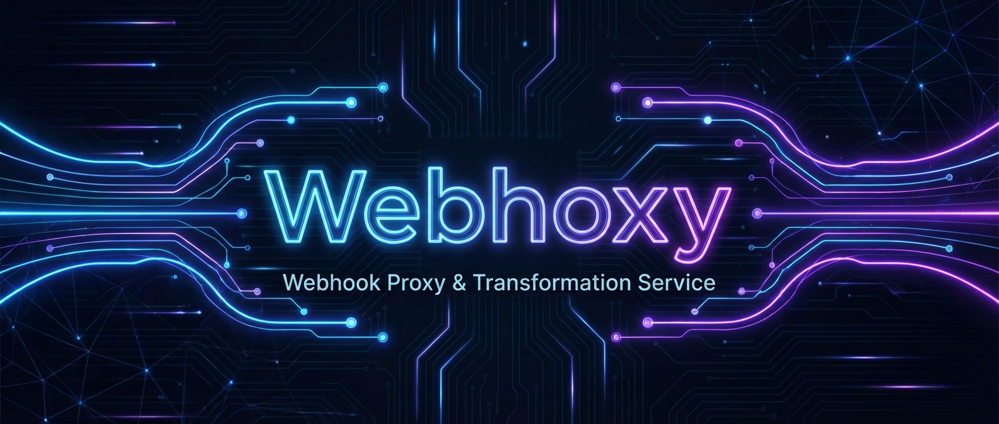

<div align="center">
  # Webhoxy: Your Ultimate Webhook Proxy & Transformation Service

  [](https://opensource.org/licenses/MIT)
  [](https://nodejs.org/)
  [](https://github.com/GenR8ive/Webhoxy/blob/main/CONTRIBUTING.md)
  [](https://github.com/GenR8ive/Webhoxy)

  
</div>

Webhoxy is a powerful, open-source webhook proxy service designed to streamline your development and integration workflows. Built with performance in mind using **Fastify** and a dynamic user interface powered by **SolidJS**, Webhoxy allows you to effortlessly receive, inspect, transform, and forward webhooks from any third-party service to your local development environment or production systems.

## ✨ Features

*   **Universal Webhook Reception**: Capture webhooks from any service (GitHub, Stripe, Shopify, etc.).
*   **Payload Transformation**: Dynamically modify webhook payloads using flexible JSON templating and scripting before forwarding.
*   **Real-time Monitoring**: A sleek, real-time UI to view incoming webhooks, their processing status, and detailed logs.
*   **Conditional Forwarding**: Set up rules to forward webhooks based on their content or headers.
*   **High Performance**: Leveraging Fastify for blazing-fast API responses and SolidJS for a reactive, efficient frontend.
*   **Secure & Scalable**: Designed for reliability and easy deployment in various environments.

## 🚀 Getting Started

Dive into Webhoxy with these simple steps.

### Prerequisites

*   Node.js (v20 or higher)
*   Docker & Docker Compose (recommended for production deployments)

### Installation & Setup

#### 1. Clone the Repository

```bash
git clone https://github.com/GenR8ive/Webhoxy.git
cd Webhoxy
```

#### 2. Running with Docker (Recommended for Production & Easy Setup)

The easiest way to get Webhoxy up and running is with Docker Compose.

```bash
docker-compose up --build -d
```

This command will:
*   Build the `api` and `web` services.
*   Start the Webhoxy API on `http://localhost:8080`.
*   Start the Webhoxy UI on `http://localhost:5173`.
*   Set up a PostgreSQL database.

#### 3. Running Locally (Development)

If you prefer to run services independently for development:

**a. Install Dependencies**

```bash
npm install # Install root dependencies
cd api && npm install && cd ..
cd web && npm install && cd ..
```

**b. Start Services**

In separate terminal windows:

```bash
# Terminal 1: Start API
cd api
npm run dev
```
The API will be available at `http://localhost:8080`.

```bash
# Terminal 2: Start Web UI
cd web
npm run dev
```
The Web UI will be available at `http://localhost:5173`.

### Default Admin Credentials

Upon first launch, Webhoxy creates a default administrator account for you to get started.

*   **Username**: `admin`
*   **Password**: `password`

**Important**: For production deployments, it is highly recommended to change these default credentials immediately after your first login via the UI settings or environment variables.

## 📖 Documentation

Explore the full capabilities of Webhoxy with our comprehensive documentation:

*   [Deployment Guide](DEPLOYMENT.md)
*   [Development Guide](DEVELOPMENT.md)
*   [Environment Configuration](ENV_CONFIG.md)
*   [Architecture Overview](ARCHITECTURE.md)
*   [API Reference](API_REFERENCE.md)

## ✍️ Learn More

For a deeper dive into Webhoxy's design principles, use cases, and future roadmap, check out our introductory blog post:

[Read the Webhoxy Launch Blog Post](https://blog.example.com/introducing-webhoxy-your-webhook-supercharger) (Placeholder Link)

## 🤝 Contributing

We welcome contributions from the community! Whether it's bug reports, feature requests, or code contributions, please refer to our [CONTRIBUTING.md](CONTRIBUTING.md) guide for details.

## 📄 License

Webhoxy is open-source software licensed under the [MIT License](LICENSE).
